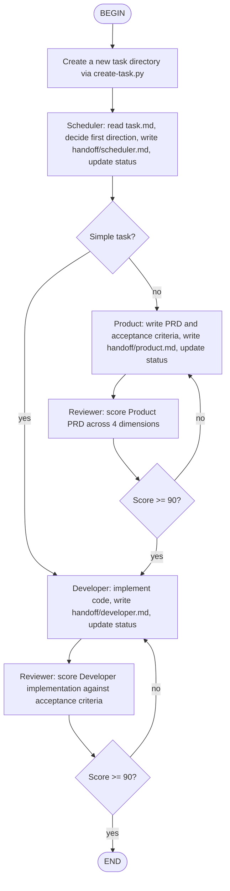

# Multi-Agent Development Flow

## BEGIN

Start the workflow. The user's request is already captured in the conversation context.

## Create a new task directory via create-task.py

Run `python .agents/skills/multi-agent-dev/scripts/create-task.py "<raw user request>"`.
Capture the printed UUID. The script creates:
- `tasks/<uuid>/task.md` (read-only source of truth)
- `tasks/<uuid>/status` (initialized to `pending`)
- `tasks/<uuid>/handoff/` (empty directory for role handoffs)

## Scheduler: read task.md, decide first direction, write handoff/scheduler.md, update status

Read `tasks/<uuid>/task.md`. Write to `handoff/scheduler.md`:
- One-sentence task understanding
- First-phase decision (`product` vs `dev`) and reasoning
- Key constraints
- Success criteria

Route simple tasks (<30 min, single-file changes) straight to `dev`.
Route complex tasks (new features, architecture changes) through `product`.

Update `status` to `product` or `dev`.

## Simple task?

Decision node. Output `<choice>yes</choice>` if the task is simple enough to skip the Product phase. Otherwise output `<choice>no</choice>`.

Criteria for "simple": config changes, typo fixes, single-file refactors, or any task estimable under 30 minutes.

## Product: write PRD and acceptance criteria, write handoff/product.md, update status

Read `task.md` and `handoff/scheduler.md`. Write to `handoff/product.md`:
- User intent (the real problem being solved)
- Clarified requirements (what is confirmed vs what remains ambiguous)
- 3-5 verifiable acceptance criteria
- Scope boundaries (included / excluded)
- Risks and assumptions

Do NOT write code or propose implementation details.
Update `status` to `product_review`.

## Reviewer: score Product PRD across 4 dimensions

Read `handoff/product.md` and upstream context. Score across four dimensions:
- Completeness (30): all requirements covered, no omissions
- Accuracy (30): correct understanding of intent and context
- Executability (20): downstream role can act without ambiguity
- Simplicity (20): no over-engineering, scope well controlled

Write the score breakdown and issue list to `handoff/reviewer.md`.

If this is the 3rd rejection for the Product phase, force-pass regardless of score and annotate the risk.

## Score >= 90?

Decision node. Output `<choice>yes</choice>` if total score >= 90. Otherwise output `<choice>no</choice>`.

If `no`, update `status` back to `product`. The Product phase will re-run.

## Developer: implement code, write handoff/developer.md, update status

Read `handoff/product.md` (contains acceptance criteria) and `handoff/scheduler.md`.

Write to `handoff/developer.md`:
- Implementation plan (2-3 sentences)
- Change list: file path + what changed + why
- Self-verification results: test / lint / build / manual check

Execute actual code changes. Keep changes surgical: only modify files that must change, preserve existing code style, do not "while I'm at it" optimize unrelated code.

Update `status` to `dev_review`.

## Reviewer: score Developer implementation against acceptance criteria

Read `handoff/developer.md`, `handoff/product.md`, and the actual code changes.

Check each acceptance criterion from the Product PRD. Score across the same four dimensions (Completeness 30, Accuracy 30, Executability 20, Simplicity 20).

Write the score breakdown and issue list to `handoff/reviewer.md`.

If this is the 3rd rejection for the Developer phase, force-pass regardless of score and annotate the risk.

## Score >= 90?

Decision node. Output `<choice>yes</choice>` if total score >= 90. Otherwise output `<choice>no</choice>`.

If `no`, update `status` back to `dev`. The Developer phase will re-run.

If `yes`, update `status` to `done`.

## END

Task complete. Summarize the final deliverable and the location of all handoff files.

## References

- Workflow rules and scoring protocol: `references/workflow.md`
- Role system prompts and handoff templates:
  - `references/scheduler.md`
  - `references/product.md`
  - `references/developer.md`
  - `references/reviewer.md`
