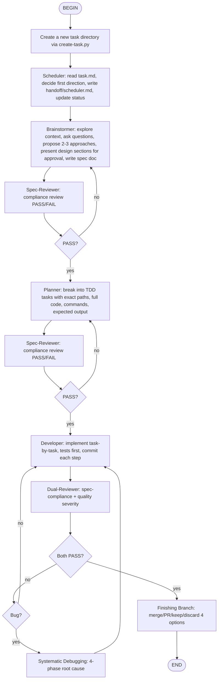

# Multi-Agent Development Flow (v2 — Superpowers Integrated)



## BEGIN

Start the workflow. The user's request is already captured in the conversation context.

## Create a new task directory via create-task.py

Run `python .agents/skills/multi-agent-dev/scripts/create-task.py "<raw user request>"`.
Capture the printed UUID. The script creates:
- `tasks/<uuid>/task.md` (read-only source of truth)
- `tasks/<uuid>/status` (initialized to `pending`)
- `tasks/<uuid>/handoff/` (empty directory for role handoffs)

## Scheduler: read task.md, decide first direction, write handoff/scheduler.md, update status

Read `tasks/<uuid>/task.md`. Write to `handoff/scheduler.md`:
- One-sentence task understanding
- First-phase decision (`brainstorm` for creative work, `plan` for config/typo fixes, or `debug` for bug fixes) and reasoning
- Key constraints
- Success criteria

Route creative work (new features, architecture changes, UI components) through `brainstorm`.
Route simple tasks (config changes, typo fixes, single-file refactors <30 min) straight to `plan`.
Route bug fixes through `debug` (systematic-debugging first, then plan).

Update `status` to `brainstorm`, `plan`, or `debug`.

## Brainstormer: explore context, ask questions, propose approaches, present design, write spec

<HARD-GATE>
Do NOT invoke any implementation skill, write any code, scaffold any project, or take any implementation action until you have presented a design and the user has approved it.
</HARD-GATE>

**Checklist (complete in order):**
1. **Explore project context** — check files, docs, recent commits in `repos/<name>/`
2. **Ask clarifying questions** — one at a time, understand purpose/constraints/success criteria
3. **Propose 2-3 approaches** — with trade-offs and your recommendation
4. **Present design** — in sections (architecture, components, data flow, error handling, testing), get user approval after each section
5. **Write design doc** — save to `tasks/<uuid>/design.md`
6. **Spec self-review** — placeholder scan, internal consistency, scope check, ambiguity check
7. **User reviews written spec** — ask user to review before proceeding

Update `status` to `brainstorm_review`.

## Spec-Reviewer: compliance review PASS/FAIL

Read `tasks/<uuid>/design.md` and upstream context.

**Review dimensions (binary PASS/FAIL for each):**
- **Completeness**: All requirements from task.md covered? No omissions?
- **Accuracy**: Correct understanding of intent and context?
- **Executability**: Downstream Planner can act without ambiguity?
- **Simplicity**: No over-engineering, scope well controlled?

Write to `handoff/spec-reviewer.md`:
- PASS/FAIL per dimension
- Issue list (if any)
- Overall verdict: PASS or FAIL

**Rules:**
- ALL dimensions must PASS → overall PASS
- ANY dimension FAIL → overall FAIL, return to Brainstormer
- 3rd rejection → force-pass, annotate risk

Update `status` to `plan` (if PASS) or `brainstorm` (if FAIL).

## Planner: break into TDD tasks with exact paths, full code, commands, expected output

Read `tasks/<uuid>/design.md` and `handoff/scheduler.md`.

Write implementation plan to `tasks/<uuid>/plan.md`.

**Plan header:**
```markdown
# [Feature Name] Implementation Plan

**Goal:** [One sentence]
**Architecture:** [2-3 sentences]
**Tech Stack:** [Key technologies]

---
```

**Task structure (bite-sized, 2-5 min each):**
```markdown
### Task N: [Component Name]

**Files:**
- Create: `exact/path/to/file.py`
- Modify: `exact/path/to/existing.py:123-145`
- Test: `tests/exact/path/to/test.py`

- [ ] **Step 1: Write the failing test**
  ```python
  def test_specific_behavior():
      result = function(input)
      assert result == expected
  ```

- [ ] **Step 2: Run test to verify it fails**
  Run: `pytest tests/path/test.py::test_name -v`
  Expected: FAIL with "function not defined"

- [ ] **Step 3: Write minimal implementation**
  ```python
  def function(input):
      return expected
  ```

- [ ] **Step 4: Run test to verify it passes**
  Run: `pytest tests/path/test.py::test_name -v`
  Expected: PASS

- [ ] **Step 5: Commit**
  ```bash
  git add tests/path/test.py src/path/file.py
  git commit -m "feat: add specific feature"
  ```
```

**Plan rules:**
- Exact file paths always
- Complete code in every step — no placeholders, no "TBD", no "similar to Task N"
- Exact commands with expected output
- DRY, YAGNI, TDD, frequent commits
- If spec covers multiple independent subsystems, break into separate plans

**Self-review after writing:**
1. Spec coverage: can you point to a task for each requirement?
2. Placeholder scan: any red flags?
3. Type consistency: signatures match across tasks?

Update `status` to `plan_review`.

## Spec-Reviewer (Plan Phase): compliance review PASS/FAIL

Same process as Brainstormer phase.

Read `tasks/<uuid>/plan.md`. Check:
- Completeness: every design requirement has a task?
- Accuracy: tasks match design intent?
- Executability: zero-context engineer could follow?
- Simplicity: no bundled refactoring, no scope creep?

Write to `handoff/plan-reviewer.md`.

Update `status` to `dev` (if PASS) or `plan` (if FAIL).

## Developer: implement task-by-task, tests first, commit each step

Read `tasks/<uuid>/plan.md` and `handoff/scheduler.md`.

**Execution mode:**
- **Subagent-driven (recommended)**: Fresh subagent per task, isolated context
- **Inline**: Execute in this session if tasks are tightly coupled

For each task:
1. Write failing test
2. Run test → verify FAIL
3. Write minimal implementation
4. Run test → verify PASS
5. Commit
6. Mark task complete

**Handoff doc (`handoff/developer.md`):**
- Implementation plan summary
- Change list: file path + what changed + why
- Self-verification results: test/lint/build/manual check

Update `status` to `dev_review`.

## Dual-Reviewer: spec-compliance + quality severity

**Layer 1 — Spec-Reviewer (compliance):**
Read `handoff/developer.md`, `tasks/<uuid>/plan.md`, and actual code changes.

Check each acceptance criterion from plan. Binary PASS/FAIL per dimension:
- Completeness, Accuracy, Executability, Simplicity

**Layer 2 — Quality-Reviewer (severity):**
Read the same materials + code style, architecture, edge cases, performance.

Score issues by severity (no numeric score, just classification):
- **Critical**: Must fix before proceeding (security, data loss, broken contract)
- **Important**: Should fix before proceeding (maintainability, clarity, missing tests)
- **Minor**: Note for later (naming, formatting, style)

Write to `handoff/dual-reviewer.md`:
```markdown
## Spec Compliance Layer
- Completeness: PASS/FAIL
- Accuracy: PASS/FAIL
- Executability: PASS/FAIL
- Simplicity: PASS/FAIL
- Overall: PASS/FAIL
- Issues: [...]

## Quality Layer
- Critical: [...]
- Important: [...]
- Minor: [...]
- Overall verdict: PROCEED / FIX-CRITICAL / FIX-ALL
```

**Rules:**
- Spec layer ALL PASS + Quality layer no Critical → PROCEED
- Spec layer FAIL → return to Developer
- Critical issues → return to Developer
- 3rd rejection → force-pass, annotate risk

Update `status` to `done` (if PROCEED), `debug` (if bug found), or `dev` (if fix needed).

## Systematic Debugging: 4-phase root cause

**Trigger:** When Dual-Reviewer finds bugs, or when tests fail during implementation.

**The Four Phases (MUST complete each before next):**

### Phase 1: Root Cause Investigation
1. Read error messages carefully — stack traces, line numbers, error codes
2. Reproduce consistently — exact steps, every time?
3. Check recent changes — git diff, recent commits, new deps
4. Gather evidence in multi-component systems — log at each boundary
5. Trace data flow backward — where does bad value originate?

### Phase 2: Pattern Analysis
1. Find working examples in same codebase
2. Compare against reference implementations (read every line)
3. Identify differences between working and broken
4. Understand dependencies, config, assumptions

### Phase 3: Hypothesis and Testing
1. Form single hypothesis: "I think X is the root cause because Y"
2. Test minimally — smallest possible change, one variable
3. Verify → yes = Phase 4, no = new hypothesis

### Phase 4: Implementation
1. Create failing test case (simplest reproduction)
2. Implement single fix — ONE change, no bundled refactoring
3. Verify fix — test passes? No other tests broken?
4. If 3+ fixes failed → STOP, question architecture, discuss with user

**Red flags — STOP and return to Phase 1:**
- "Quick fix for now, investigate later"
- "Just try changing X and see if it works"
- "Skip the test, I'll manually verify"
- "One more fix attempt" (already tried 2+)

Write findings to `handoff/debug.md`. Return to Developer.

## Finishing Branch: merge/PR/keep/discard 4 options

**Trigger:** When status reaches `done`.

**Step 1: Verify tests pass**
```bash
npm test / cargo test / pytest / go test ./...
```
If tests fail → STOP, return to Systematic Debugging.

**Step 2: Determine base branch**
```bash
git merge-base HEAD main 2>/dev/null || git merge-base HEAD master 2>/dev/null
```

**Step 3: Present exactly 4 options**
```
Implementation complete. What would you like to do?

1. Merge back to <base-branch> locally
2. Push and create a Pull Request
3. Keep the branch as-is (I'll handle it later)
4. Discard this work

Which option?
```

**Step 4: Execute choice**
- **Option 1 (Merge)**: checkout base, pull, merge, verify tests, delete branch, cleanup worktree
- **Option 2 (PR)**: push branch, create PR with summary + test plan, keep worktree
- **Option 3 (Keep)**: report branch name and worktree path, keep everything
- **Option 4 (Discard)**: require typed "discard" confirmation, delete branch and worktree

**Step 5: Final handoff**
Write `handoff/finish.md`:
- Option chosen
- Actions taken
- Branch state
- Any follow-up tasks

Update `status` to `closed`.

## END

Task complete. Summarize:
- Final deliverable
- Location of all handoff files
- Any risks or follow-up items

## References

- Workflow rules and scoring protocol: `references/workflow.md`
- Role system prompts and handoff templates:
  - `references/scheduler.md`
  - `references/brainstormer.md`
  - `references/planner.md`
  - `references/developer.md`
  - `references/spec-reviewer.md`
  - `references/quality-reviewer.md`
  - `references/systematic-debugging.md`
  - `references/finishing-branch.md`
